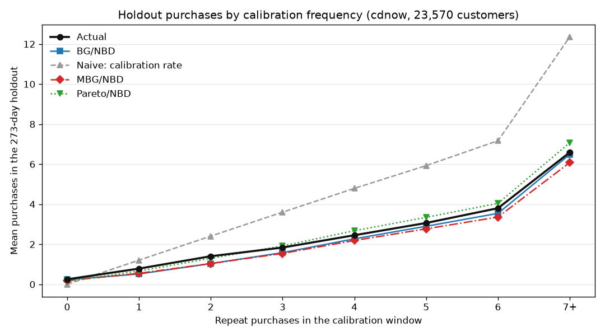
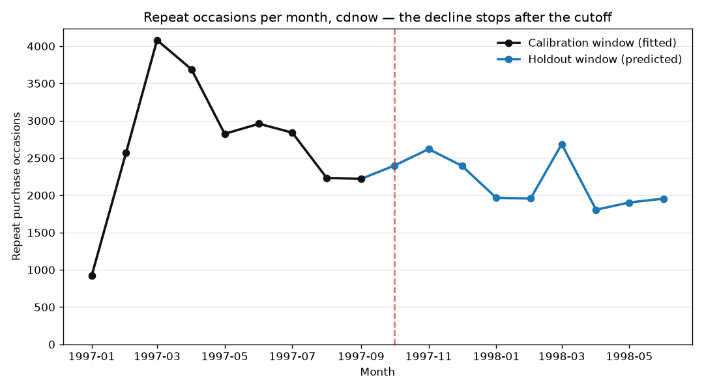
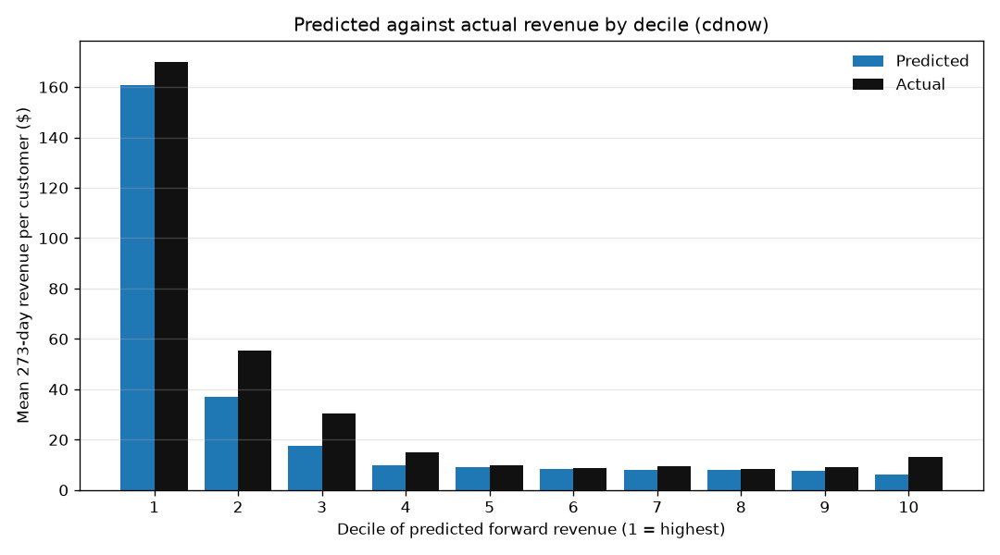

# Validation — cdnow

Generated by `uv run ltv validate`. Every number here is computed from `int_customers__scored`, which joins the predictions in the warehouse to the holdout window they are scored against; it is rebuilt immediately before this report is written, and a build fails if the predictions no longer match the data they were fitted on.

- **Population:** 23,570 customers
- **Scoring horizon:** 273 days, read from the analysis window rather than configured
- **Fit method:** `map`

## Headline

Over the 273-day holdout window, the model predicts **16,867** purchases against **19,684** actual — **-14.3%**. The naive rule that each customer keeps repeating at their calibration rate predicts 29,011 (+47.4%), and assuming every customer is average predicts 29,001 (+47.3%).

The fairest comparison is the same-period rule -- predict that a customer repeats as often as they did last window, which needs no rescaling because the two windows are the same length. It predicts 24,337 (+23.6%). **The rate baselines above are inflated**: they divide by each customer's observation length and multiply by the holdout length, and mean customer age here is shorter than the holdout, so they scale every calibration count up before comparing. Roughly half of their +47% is rescaling rather than naivety.

On per-customer error the model beats all 4 naive rules: MAE 0.818 against 0.835, 0.911, 1.038 and 1.389.

**Read that MAE against the row below it, not against the others.** Predicting that nobody buys anything scores 0.835, because 16,512 of these customers genuinely buy nothing. On a mostly-zero quantity the all-zero rule is what MAE is really measured against, and the model clears it by 2.0%. This model's value is in aggregate totals and in ranking, not in per-customer accuracy -- the sections below are where it earns its place.

## Purchase counts

| Model | MAE | RMSE | Actual total | Predicted total | Error % | Spearman ρ | MAPE % |
| --- | --- | --- | --- | --- | --- | --- | --- |
| BG/NBD + Gamma-Gamma | 0.818 | 1.733 | 19,684 | 16,867 | -14.3 | 0.442 | not reported |
| Naive: same as last window | 0.911 | 1.936 | 19,684 | 24,337 | 23.6 | 0.485 | not reported |
| Naive: calibration rate | 1.038 | 2.158 | 19,684 | 29,011 | 47.4 | 0.485 | not reported |
| Naive: population mean | 1.389 | 2.355 | 19,684 | 29,001 | 47.3 | — | not reported |
| Naive: nobody buys | 0.835 | 2.467 | 19,684 | 0 | -100.0 | — | not reported |
| MBG/NBD | 0.795 | 1.741 | 19,684 | 15,887 | -19.3 | 0.445 | not reported |
| Pareto/NBD | 0.806 | 1.723 | 19,684 | 18,205 | -7.5 | 0.452 | not reported |

MAPE is deliberately not reported for purchase counts. Most customers make no holdout purchase at all, so it would be computed over a minority of the population and read as though it described the whole of it. The signed aggregate error and the per-customer MAE carry the same information without the false precision.

## Forward revenue

| Model | MAE | RMSE | Actual total | Predicted total | Error % | Spearman ρ | MAPE % |
| --- | --- | --- | --- | --- | --- | --- | --- |
| BG/NBD + Gamma-Gamma | 32.657 | 92.928 | 776,961 | 642,283 | -17.3 | 0.421 | 81.9 |
| Naive: same as last window | 37.695 | 114.785 | 776,961 | 938,830 | 20.8 | 0.478 | 122.7 |
| Naive: calibration rate | 42.319 | 133.007 | 776,961 | 1,119,760 | 44.1 | 0.479 | 141.9 |
| Naive: population mean | 55.423 | 125.152 | 776,961 | 1,033,348 | 33.0 | — | 86.3 |
| Naive: nobody buys | 32.964 | 128.963 | 776,961 | 0 | -100.0 | — | 100.0 |

MAPE covers the 7,058 customers whose actual is non-zero and excludes 16,512 (70.1% of the 23,570 scored). A percentage error against an actual of zero is undefined, not large.

## Average order value

| Model | MAE | RMSE | Sum of per-customer means | Predicted, same basis | Error % | Spearman ρ | MAPE % |
| --- | --- | --- | --- | --- | --- | --- | --- |
| BG/NBD + Gamma-Gamma | 18.142 | 31.357 | 265,814 | 258,970 | -2.6 | 0.390 | 63.4 |
| Naive: calibration rate | 19.035 | 32.972 | 265,814 | 258,680 | -2.7 | 0.387 | 64.8 |

MAPE covers all 7,058 scored customers; every one has a non-zero actual, so none had to be excluded.

Scored only on customers who made at least one holdout purchase. An average order value of zero means the customer did not buy, not that they bought for nothing, and averaging those in would score the spend model against a quantity that does not exist for them.

## Fitting is not predicting

The same model, measured on the window it was fitted on and on the window it was not:

| Window | Actual | Expected | Error % |
| --- | --- | --- | --- |
| Calibration (in-sample) | 24,337 | 24,533 | 0.8 |
| Holdout (out-of-sample, 273 days) | 19,684 | 16,867 | -14.3 |

The in-sample row is a description of data the model has already seen and is **not** evidence of predictive accuracy. It is printed precisely so that the gap between the two rows is visible: a model can describe its training window almost exactly and still miss the next one.

Calibration expectations use the unconditional E[X(t)] with each customer's own observation length, which counts repeat transactions — the same quantity as the calibration frequency it is compared against.

## Where the error lives

Mean holdout purchases by the number of repeat purchases a customer made during calibration. `Shortfall` is the total purchases the model missed in that bucket (negative means it over-predicted).

| Calibration repeats | Customers | Actual | BG/NBD + Gamma-Gamma | Naive: calibration rate | MBG/NBD | Pareto/NBD | Shortfall |
| --- | --- | --- | --- | --- | --- | --- | --- |
| 0 | 14,119 | 0.251 | 0.230 | 0.000 | 0.182 | 0.150 | -300 |
| 1 | 4,442 | 0.784 | 0.517 | 1.207 | 0.548 | 0.664 | -1,185 |
| 2 | 2,064 | 1.403 | 1.037 | 2.408 | 1.038 | 1.298 | -755 |
| 3 | 1,084 | 1.837 | 1.581 | 3.604 | 1.543 | 1.917 | -277 |
| 4 | 605 | 2.451 | 2.272 | 4.791 | 2.188 | 2.676 | -109 |
| 5 | 348 | 3.063 | 2.899 | 5.929 | 2.771 | 3.346 | -57 |
| 6 | 272 | 3.801 | 3.543 | 7.171 | 3.360 | 4.042 | -70 |
| 7+ | 636 | 6.591 | 6.491 | 12.361 | 6.082 | 7.071 | -63 |

The aggregate miss of 2,817 purchases is not spread evenly. Customers with exactly one or two calibration repeats account for 1,940 of it (69%). BG/NBD writes those customers off faster than the data supports: having seen one repeat and then a gap, it concludes they have probably churned.

### Why the model falls short

BG/NBD can only explain a falling purchase rate as customers dropping out, so it extrapolates the calibration decline forward. The realised series declines through calibration and then levels off. The model keeps decaying; the cohort does not.

Read the first three months as cohort formation rather than growth: every customer in this dataset makes their first purchase in Q1 1997, so the repeat series necessarily climbs while the cohort is still being acquired. The part that matters is what happens after it: a steep fall to the cutoff, and then a flat stretch the model has no way to represent.

## Model comparison

Alternative purchase models, fitted at MAP on the identical calibration frame and scored over the identical window. They test whether the shortfall is this model's assumptions or the data's behaviour — they are not promoted, and the champion in `model.customer_predictions` remains BG/NBD.

They are scored on purchase counts only, and appear in the Purchase counts table above. MBG/NBD and Pareto/NBD model *when* a customer buys, not how much they spend; pairing one of them with the champion's Gamma-Gamma fit and calling the product a revenue forecast would attribute the spend model's behaviour to a purchase model that had nothing to do with it.

**In the one- and two-repeat buckets, where most of the shortfall sits, the models genuinely differ.** Purchases missed across those two buckets: Pareto/NBD -749, MBG/NBD -1,802, BG/NBD + Gamma-Gamma -1,940, Naive: calibration rate +3,952. Pareto/NBD comes closest of the fitted models; the naive rules are listed for scale and are not candidates for this conclusion.

That is a result about dropout timing rather than about estimation. BG/NBD only lets a customer churn immediately after a purchase; Pareto/NBD lets them churn at any moment, governed by an exponential lifetime. A customer who repeated once and then went quiet is exactly the case those two assumptions disagree about most.

| Model | Status | Detail |
| --- | --- | --- |
| MBG/NBD | fitted | a = 0.835, alpha = 47.954, b = 1.354, kappa_dropout = 2.189, phi_dropout = 0.381, r = 0.589 |
| Pareto/NBD | fitted | alpha = 77.123, beta = 37.186, r = 0.589, s = 0.403 |

## Does the ranking work?

Customers ranked by predicted forward revenue and split into ten equal groups, against what they actually spent. This is the question the project's stated purpose asks — which segments are worth acquiring is a question about order, not about absolute error, and a model can score well on one while being useless at the other.

| Decile | Customers | Mean predicted | Mean actual | Total actual | Share of actual | Mean actual (naive ranking) | Share (naive ranking) |
| --- | --- | --- | --- | --- | --- | --- | --- |
| 1 | 2,357 | 160.88 | 170.04 | 400,790 | 51.6% | 166.27 | 50.4% |
| 2 | 2,357 | 37.10 | 55.40 | 130,587 | 16.8% | 55.33 | 16.8% |
| 3 | 2,357 | 17.43 | 30.31 | 71,437 | 9.2% | 33.86 | 10.3% |
| 4 | 2,357 | 9.84 | 15.14 | 35,676 | 4.6% | 19.28 | 5.8% |
| 5 | 2,357 | 8.93 | 9.88 | 23,282 | 3.0% | 9.85 | 3.0% |
| 6 | 2,357 | 8.54 | 8.85 | 20,860 | 2.7% | 8.89 | 2.7% |
| 7 | 2,357 | 8.17 | 9.39 | 22,127 | 2.8% | 8.07 | 2.4% |
| 8 | 2,357 | 7.84 | 8.38 | 19,756 | 2.5% | 9.57 | 2.9% |
| 9 | 2,357 | 7.50 | 8.94 | 21,062 | 2.7% | 7.58 | 2.3% |
| 10 | 2,357 | 6.27 | 13.32 | 31,384 | 4.0% | 10.95 | 3.3% |

The top decile captures **51.6%** of all realised holdout revenue, against **50.4%** when the same customers are ranked by the naive calibration-rate rule instead. A ranking with no discriminating power would capture 10%.

**The honest reading is that almost all of that capture is available without the model.** The naive rule gets to within 1.1 percentage points of it, and on rank correlation it is actually **ahead**: Spearman ρ 0.479 against the model's 0.421 on revenue, and 0.485 against 0.442 on purchase counts. Ranking customers by what they already spent is a strong rule on this dataset, and the modelling does not improve on it.

The ordering is also not merely flat below decile 4 -- it is mildly **inverted**. Decile 10, the lowest-predicted tenth, realises a mean of 13.32 against 8.38-9.88 across deciles 5-9. Below the top few deciles the model is not ranking these customers at all, which is consistent with what it has to work with: most of them made no repeat purchase, so their predictions differ only through customer age.

What the model does add over that rule is calibration rather than order: it puts the predictions on a scale that is 14% low rather than 47% high, and it assigns a value to every customer including those with no repeat history. For choosing *who* to target, the naive rule is competitive. For forecasting *how much*, it is not.

## Assumption checks

### Gamma-Gamma: monetary value independent of frequency

Spearman ρ between calibration frequency and mean repeat order value, across the 9,450 Gamma-Gamma-eligible customers: **+0.198** (p = 2.8e-84).

| Calibration repeats | Customers | Mean repeat order value |
| --- | --- | --- |
| 1 | 4,441 | 33.42 |
| 2 | 2,064 | 35.60 |
| 3 | 1,084 | 36.63 |
| 4 | 605 | 38.15 |
| 5 | 348 | 39.31 |
| 6 | 272 | 41.08 |
| 7+ | 636 | 42.71 |

**The assumption does not hold here.** Mean repeat order value climbs from 33.42 to 42.71 across the frequency range, a spread of 28%. Gamma-Gamma shrinks every customer toward a common population mean, so it systematically under-values heavy buyers and over-values light ones. That is the same axis a "which segments are worth acquiring" conclusion runs along, so **segment-level value rankings from this model are compressed** and the gaps between segments are understated.

### BG/NBD: probability_alive for customers who never repeated

**14,119 customers (59.9% of the base) have a probability of being alive of exactly 1.0.** This is a property of the model, not a finding about them: BG/NBD only allows a customer to drop out immediately after a purchase, so a customer with no repeat purchase has never had an opportunity to. Only 14.6% of them actually transacted in the holdout window.

No segment definition and no dashboard tile may treat this as evidence that these customers are healthy. It is the single easiest number in the project to misread.

## Against the published CDNOW figures

Fader, Peter S., Bruce G. S. Hardie, and Ka Lok Lee (2005), "'Counting Your Customers' the Easy Way: An Alternative to the Pareto/NBD," Marketing Science, 24 (2), 275-284. — Table 2, p. 281.

| Parameter | This project (days) | This project (weeks) | Published (weeks) |
| --- | --- | --- | --- |
| r | 0.250 | 0.250 | 0.243 |
| alpha | 33.011 | 4.716 | 4.414 |
| a | 0.717 | 0.717 | 0.793 |
| b | 2.125 | 2.125 | 2.426 |

`alpha` is the rate parameter of the gamma distribution over the per-unit-time transaction rate, so it carries the time unit: this project works in days and the paper in weeks, which divides it by 7. `r`, `a` and `b` are dimensionless and are compared unconverted.

**This is a consistency check, not a reproduction.** The published fit uses a 1/10th systematic sample of 2,357 customers; this one uses the full master file of 23,570. Two different samples of the same cohort landing on similar parameters is evidence the implementation is right; identical parameters were never the expected outcome.

The paper reports the BG/NBD under-forecasting by 4% and the Pareto/NBD by 2% over the forecast period. **That figure is cumulative across all 78 weeks and must not be read against the holdout-only error above**: an in-sample fit accurate to within a percent over the first 39 weeks dilutes whatever happens in the second 39. The "Fitting is not predicting" table gives both bases so the two can be compared like with like.

One structural detail reproduces independently and is worth noting: the paper's zero-class is 1,411 of 2,357 customers (59.9%). On the full file it is 14,119 of 23,570 — also 59.9%.

## What this report does not establish

- **No uncertainty intervals.** This is a `map` fit. MAP returns a single point, so any interval computed from it would be zero-width and read as certainty. Intervals require `uv run ltv fit --full-bayes`.
- **LTV here means expected forward revenue over a stated horizon, undiscounted** — not gross margin. Margin and discount rate are business inputs this dataset does not contain.
- **One dataset, one cohort.** Every customer here made their first purchase at CDNOW in Q1 1997. Nothing about how the model behaves on a continuously-acquiring population is demonstrated by these numbers.
- **Segment-level value rankings are compressed** by the Gamma-Gamma violation above. The ordering is informative; the size of the gaps between segments is understated.
